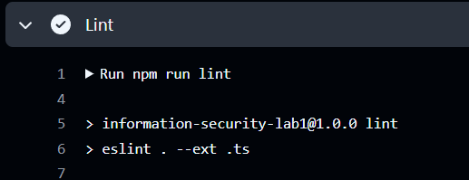
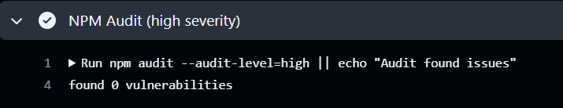
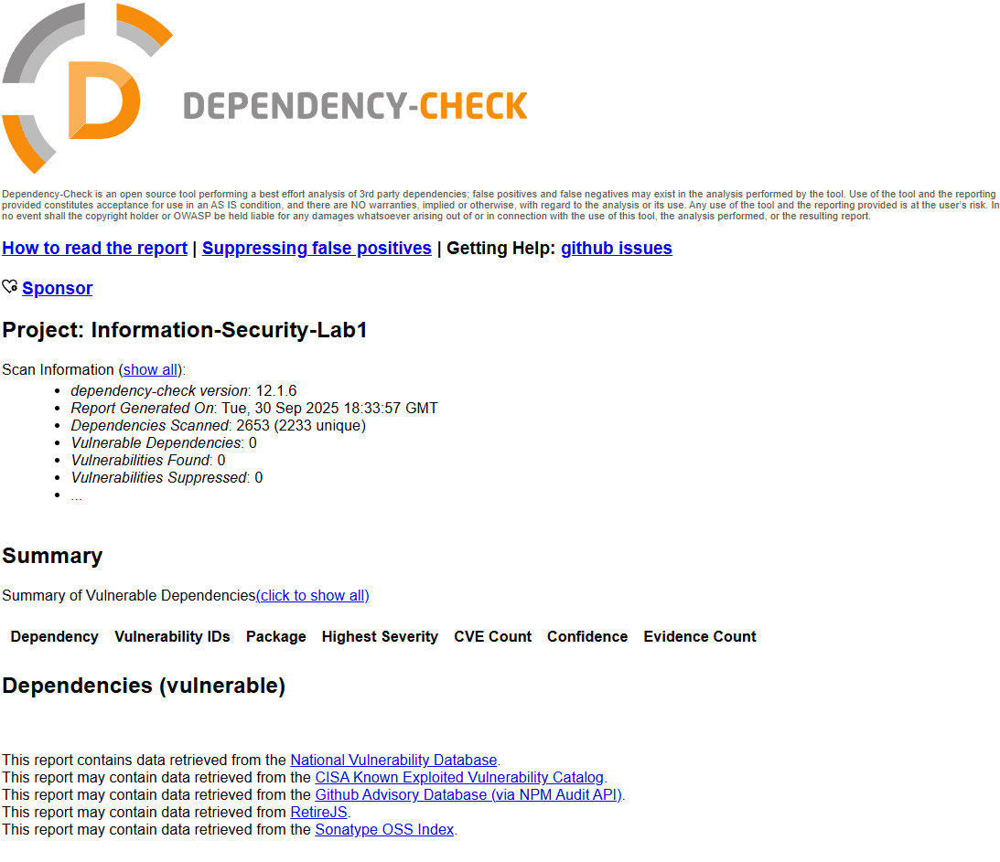

# Лабораторная работа 1

Проект — небольшое REST API с мерами защиты и автоматическими проверками безопасности в CI/CD.

## Стек

- Язык/платформа: JavaScript/TypeScript (Node.js 20)
- Фреймворк: Express 5
- База данных: PostgreSQL 16 (драйвер `pg`)
- Аутентификация: JWT (HS256), хэширование паролей — bcrypt
- Защита: helmet, CORS, rate limiting, валидация входных данных (Joi)
- CI/CD: GitHub Actions (SAST — ESLint + `@typescript-eslint` + `eslint-plugin-security`, SCA — OWASP Dependency-Check + `npm audit`)

Ссылки:

- Репозиторий: [https://github.com/Wgmlgz/Information-Security-Lab1](https://github.com/Wgmlgz/Information-Security-Lab1)
- Последний успешный pipeline: [https://github.com/Wgmlgz/Information-Security-Lab1/actions/runs/18140311981](https://github.com/Wgmlgz/Information-Security-Lab1/actions/runs/18140311981)

## Эндпоинты и вызовы

- `GET /health` — проверка живости сервиса
- `POST /auth/login` — аутентификация пользователя
  - Тело запроса: `{ "username": "string", "password": "string" }`
  - Ответ: `{ "token": "<JWT>" }`
- `GET /api/data` — список постов (требуется JWT)
  - Заголовок: `Authorization: Bearer <JWT>`
- `POST /api/posts` — создать пост (требуется JWT)
  - Тело: `{ "title": "string", "body": "string" }`

При первом запуске создаётся пользователь: `admin / Password123!`.

## Реализованные меры защиты

### SQLi

- Все SQL-запросы выполняются через параметризованные выражения `pg` (плейсхолдеры `$1, $2, ...`).
- Исключена конкатенация строк при формировании запросов.

### XSS

- API отдаёт только JSON и не рендерит HTML — снижает риск отражённого/DOM-XSS со стороны сервера.
- Валидация входных данных (Joi), ограничения длин полей.
- Заголовки безопасности через `helmet` (например, `X-Content-Type-Options: nosniff`, `X-Frame-Options: SAMEORIGIN`, `Referrer-Policy` и др.).
- CORS управляется переменной `CORS_ORIGIN` (в продакшене рекомендуется указать конкретный фронтенд-оригин).

### Broken Authentication

- Выдача JWT после успешного логина; срок действия — 1 час; алгоритм HS256.
- Middleware проверяет JWT на защищённых эндпоинтах; при отсутствии/невалидности — `401`.
- Пароли хранятся только в виде bcrypt-хэшей (cost=12).
- Ограничения: rate limit и лимит размера JSON-тел.

## CI/CD и отчёты безопасности

Скриншоты/отчёты:

